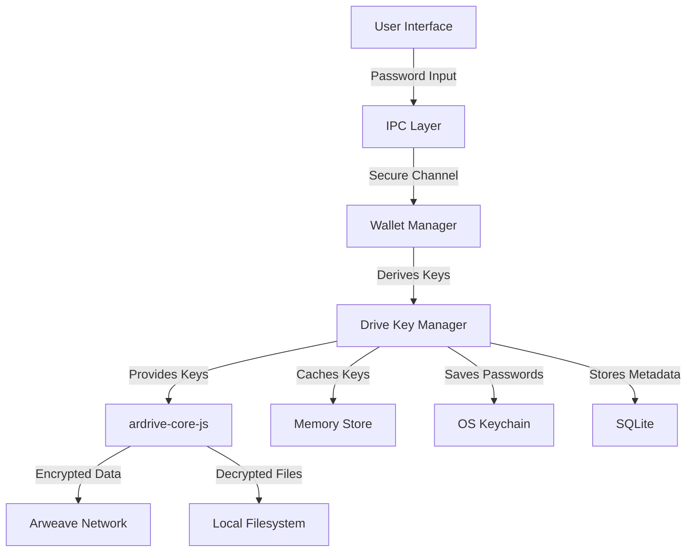
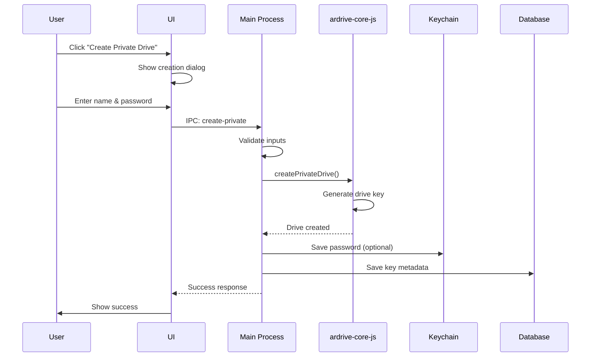
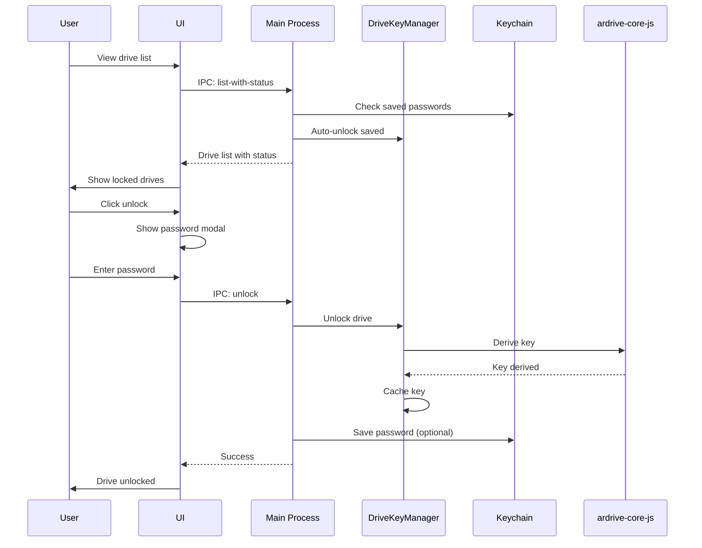
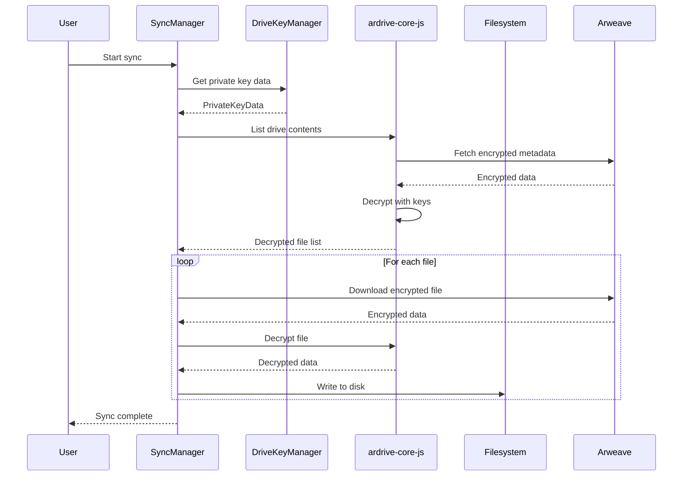

# ArDrive Desktop MVP - Private Drives Implementation Guide

## Table of Contents
1. [Overview](#overview)
2. [Architecture](#architecture)
3. [Security Model](#security-model)
4. [Implementation Plan](#implementation-plan)
5. [Core Components](#core-components)
6. [User Flows](#user-flows)
7. [API Reference](#api-reference)
8. [Testing Strategy](#testing-strategy)
9. [Migration & Compatibility](#migration--compatibility)
10. [Security Considerations](#security-considerations)

## Overview

This document outlines the complete implementation of Private Drives support in ArDrive Desktop MVP. Private Drives provide end-to-end encryption for files stored on Arweave, ensuring that only users with the correct drive password can access the content.

### Key Features
- AES-256-GCM encryption for all files and metadata
- Hierarchical key derivation (drive keys → file keys)
- Secure password management with OS keychain integration
- Seamless sync between local filesystem and encrypted Arweave storage
- Support for existing private drives created via web/CLI

### Technical Stack
- **ardrive-core-js v3.0.0** - Core encryption and ArFS operations
- **Node.js crypto** - Additional cryptographic operations
- **Keytar** - OS keychain integration
- **SQLite** - Encrypted key metadata storage

## Architecture

### High-Level Architecture

```
┌─────────────────────────────────────────────────────────────┐
│                        Renderer Process                      │
│  ┌─────────────────┐  ┌──────────────┐  ┌──────────────┐  │
│  │  Drive List UI  │  │ Unlock Modal │  │  Sync Setup  │  │
│  └────────┬────────┘  └──────┬───────┘  └──────┬───────┘  │
│           │                  │                   │          │
│           └──────────────────┴───────────────────┘          │
│                              │                              │
│                         IPC Channels                        │
└──────────────────────────────┬──────────────────────────────┘
                               │
┌──────────────────────────────┴──────────────────────────────┐
│                         Main Process                         │
│  ┌─────────────────┐  ┌──────────────┐  ┌──────────────┐  │
│  │ Wallet Manager  │  │ Drive Key    │  │ Sync Manager │  │
│  │    (Secure)     │  │   Manager    │  │              │  │
│  └────────┬────────┘  └──────┬───────┘  └──────┬───────┘  │
│           │                  │                   │          │
│  ┌────────┴──────────────────┴───────────────────┴───────┐  │
│  │              ardrive-core-js + Crypto Utils           │  │
│  └────────────────────────────────────────────────────────┘  │
│           │                  │                   │          │
│  ┌────────┴────────┐  ┌──────┴───────┐  ┌──────┴───────┐  │
│  │   OS Keychain   │  │   SQLite DB  │  │  Filesystem  │  │
│  └─────────────────┘  └──────────────┘  └──────────────┘  │
└──────────────────────────────────────────────────────────────┘
```

### Component Relationships



## Security Model

### Three-Tier Security Architecture

#### Tier 1: Session Memory (Runtime)
- Decrypted drive keys cached during active session
- Cleared on logout, profile switch, or app closure
- Protected using Node.js Buffer security practices
- No swap file exposure

#### Tier 2: OS Keychain (Persistent)
- Drive passwords stored in system keychain (optional)
- Account format: `ardrive-drive-${profileId}-${driveId}`
- Falls back to encrypted memory if keychain unavailable
- User controls whether passwords are saved

#### Tier 3: Encrypted Database (Metadata)
- Drive key metadata encrypted with profile master key
- Uses AES-256-GCM with scrypt key derivation
- Stores key derivation parameters, not actual keys
- Profile-isolated database files

### Key Hierarchy

```
Wallet Private Key
    └── Drive Password (user-provided)
        └── Drive Key (derived via ardrive-core-js)
            ├── File Key 1
            ├── File Key 2
            └── File Key N
```

### Encryption Details
- **Algorithm**: AES-256-GCM
- **Key Derivation**: HKDF-SHA256
- **IV Generation**: Cryptographically secure random
- **Authentication**: GCM tags prevent tampering
- **Password Requirements**: Minimum 12 characters, complexity enforced

## Implementation Plan

### Phase 1: Core Infrastructure (Week 1)

#### 1.1 Extend Crypto Utils
```typescript
// src/main/crypto-utils.ts additions
export interface DriveKeyDerivationParams {
  driveId: string;
  password: string;
  wallet: JWKInterface;
}

export async function deriveDriveKeyWithCache(
  params: DriveKeyDerivationParams
): Promise<Buffer> {
  // Implementation using ardrive-core-js
}

export async function deriveFileKey(
  driveKey: Buffer,
  fileId: string
): Promise<Buffer> {
  // Implementation using HKDF
}
```

#### 1.2 Create Drive Key Manager
```typescript
// src/main/drive-key-manager.ts
import { PrivateKeyData, DriveKey, deriveDriveKey } from 'ardrive-core-js';

export class DriveKeyManager {
  private keyCache: Map<string, DriveKey> = new Map();
  private sessionKeys: Map<string, Buffer> = new Map();
  
  constructor(
    private profileId: string,
    private walletJson: JWKInterface
  ) {}
  
  async unlockDrive(driveId: string, password: string): Promise<boolean> {
    try {
      const driveKey = await deriveDriveKey(
        password,
        driveId,
        JSON.stringify(this.walletJson)
      );
      
      this.keyCache.set(driveId, driveKey);
      return true;
    } catch (error) {
      return false;
    }
  }
  
  async getPrivateKeyData(): Promise<PrivateKeyData> {
    const keys: Record<string, DriveKey> = {};
    for (const [id, key] of this.keyCache) {
      keys[id] = key;
    }
    return new PrivateKeyData(keys);
  }
  
  clearKeys(): void {
    this.keyCache.clear();
    this.sessionKeys.clear();
  }
}
```

### Phase 2: Database Schema (Week 1)

#### 2.1 Migration Script
```sql
-- Migration: Add private drive support
CREATE TABLE IF NOT EXISTS drive_keys (
  id INTEGER PRIMARY KEY AUTOINCREMENT,
  profile_id TEXT NOT NULL,
  drive_id TEXT NOT NULL,
  key_hint TEXT,  -- Optional hint about the password
  key_salt TEXT NOT NULL,
  key_check TEXT NOT NULL,  -- Encrypted known value to verify password
  created_at DATETIME DEFAULT CURRENT_TIMESTAMP,
  last_accessed DATETIME,
  access_count INTEGER DEFAULT 0,
  UNIQUE(profile_id, drive_id),
  FOREIGN KEY (profile_id) REFERENCES profiles(id) ON DELETE CASCADE
);

CREATE INDEX idx_drive_keys_profile ON drive_keys(profile_id);
CREATE INDEX idx_drive_keys_drive ON drive_keys(drive_id);

-- Add privacy support to existing tables
ALTER TABLE drive_sync_mappings 
  ADD COLUMN drive_password_saved BOOLEAN DEFAULT 0;

ALTER TABLE file_versions
  ADD COLUMN is_encrypted BOOLEAN DEFAULT 0;
  
ALTER TABLE file_versions
  ADD COLUMN encrypted_key TEXT;
```

### Phase 3: Wallet Manager Updates (Week 2)

#### 3.1 Enhanced Wallet Manager
```typescript
// Updates to src/main/wallet-manager-secure.ts
class SecureWalletManager {
  private driveKeyManager: DriveKeyManager | null = null;
  
  async initializeDriveKeyManager(): Promise<void> {
    if (!this.walletJson || !this.currentProfileId) {
      throw new Error('Wallet not loaded');
    }
    
    this.driveKeyManager = new DriveKeyManager(
      this.currentProfileId,
      this.walletJson
    );
  }
  
  async createPrivateDrive(
    name: string,
    password: string,
    savePassword: boolean = false
  ): Promise<DriveInfo> {
    if (!this.arDrive) {
      throw new Error('Wallet not loaded');
    }
    
    // Create the private drive
    const result = await this.arDrive.createPrivateDrive({
      driveName: name,
      drivePassword: password
    });
    
    // Extract drive info
    const driveEntity = result.created.find(e => e.type === 'drive');
    const folderEntity = result.created.find(e => e.type === 'folder');
    
    if (!driveEntity || !folderEntity) {
      throw new Error('Invalid drive creation response');
    }
    
    const driveId = driveEntity.entityId.toString();
    
    // Unlock the drive immediately
    await this.driveKeyManager!.unlockDrive(driveId, password);
    
    // Save password if requested
    if (savePassword && this.isKeychainAvailable()) {
      const account = `ardrive-drive-${this.currentProfileId}-${driveId}`;
      await keychainService.setPassword(account, password);
    }
    
    // Save key metadata
    await this.saveDriveKeyMetadata(driveId, password);
    
    return {
      id: driveId,
      name,
      privacy: 'private',
      rootFolderId: folderEntity.entityId.toString(),
      metadataTxId: driveEntity.metadataTxId?.toString(),
      dateCreated: Date.now(),
      size: 0,
      isPrivate: true
    };
  }
  
  async unlockPrivateDrive(
    driveId: string,
    password: string,
    savePassword: boolean = false
  ): Promise<boolean> {
    if (!this.driveKeyManager) {
      throw new Error('Drive key manager not initialized');
    }
    
    // Try to unlock
    const success = await this.driveKeyManager.unlockDrive(driveId, password);
    
    if (success && savePassword && this.isKeychainAvailable()) {
      const account = `ardrive-drive-${this.currentProfileId}-${driveId}`;
      await keychainService.setPassword(account, password);
    }
    
    return success;
  }
  
  async listDrives(): Promise<DriveInfo[]> {
    // Get private key data for decryption
    const privateKeyData = this.driveKeyManager 
      ? await this.driveKeyManager.getPrivateKeyData()
      : new PrivateKeyData({});
    
    // List all drives
    const drives = await this.arDrive.getAllDrivesForAddress({
      address: new ArweaveAddress(this.wallet.address),
      privateKeyData
    });
    
    // Map and decrypt names
    return drives.map(drive => {
      const isPrivate = drive.drivePrivacy === 'private';
      const isUnlocked = isPrivate && privateKeyData.keys[drive.driveId];
      
      return {
        id: drive.driveId.toString(),
        name: isPrivate && !isUnlocked 
          ? `Private Drive (${drive.driveId.toString().slice(0, 8)}...)`
          : drive.name,
        privacy: drive.drivePrivacy,
        rootFolderId: drive.rootFolderId.toString(),
        dateCreated: drive.unixTime ? drive.unixTime * 1000 : Date.now(),
        size: 0,
        isPrivate,
        isUnlocked
      };
    });
  }
}
```

### Phase 4: Sync Manager Updates (Week 2)

#### 4.1 Private Drive Sync Support
```typescript
// Updates to src/main/sync-manager.ts
class SyncManager {
  async syncPrivateDrive(
    mapping: DriveSyncMapping,
    privateKeyData: PrivateKeyData
  ): Promise<void> {
    // Get drive contents with decryption
    const drive = await this.arDrive.getDriveContents({
      driveId: mapping.driveId,
      privateKeyData,
      includePrivate: true
    });
    
    // Process folders first
    for (const folder of drive.folders) {
      const localPath = this.mapArFSPathToLocal(
        folder.path,
        mapping.localFolderPath
      );
      await fs.mkdir(localPath, { recursive: true });
    }
    
    // Process files
    for (const file of drive.files) {
      await this.downloadPrivateFile(file, mapping, privateKeyData);
    }
  }
  
  private async downloadPrivateFile(
    file: ArFSFileEntity,
    mapping: DriveSyncMapping,
    privateKeyData: PrivateKeyData
  ): Promise<void> {
    // Check if already downloaded
    const localPath = this.mapArFSPathToLocal(
      file.path,
      mapping.localFolderPath
    );
    
    if (await this.isFileSynced(localPath, file)) {
      return;
    }
    
    // Download encrypted data
    const encryptedData = await this.downloadFromArweave(file.dataTxId);
    
    // Decrypt using ardrive-core-js
    const decryptedData = await privateKeyData.decryptFileData(
      encryptedData,
      file.fileId,
      file.fileKey
    );
    
    // Write to local filesystem
    await fs.writeFile(localPath, decryptedData);
    
    // Update database
    await this.recordDownload({
      fileId: file.fileId.toString(),
      driveId: mapping.driveId,
      localPath,
      dataTxId: file.dataTxId.toString(),
      isEncrypted: true
    });
  }
  
  async uploadToPrivateDrive(
    filePath: string,
    mapping: DriveSyncMapping,
    privateKeyData: PrivateKeyData
  ): Promise<void> {
    const fileName = path.basename(filePath);
    const fileData = await fs.readFile(filePath);
    const parentFolderId = await this.resolveParentFolder(
      filePath,
      mapping
    );
    
    // Upload with encryption
    const result = await this.arDrive.uploadPrivateFile({
      parentFolderId,
      wrappedFile: {
        name: fileName,
        data: fileData
      },
      driveKey: privateKeyData.keys[mapping.driveId]
    });
    
    // Record in database
    await this.recordUpload({
      ...result,
      localPath: filePath,
      isEncrypted: true
    });
  }
}
```

### Phase 5: UI Components (Week 3)

#### 5.1 Private Drive Unlock Modal
```typescript
// src/renderer/components/PrivateDriveUnlockModal.tsx
import React, { useState } from 'react';
import { Lock, Eye, EyeOff, Key, Shield } from 'lucide-react';

interface PrivateDriveUnlockModalProps {
  drive: DriveInfo;
  onUnlock: (password: string, savePassword: boolean) => Promise<void>;
  onCancel: () => void;
}

export const PrivateDriveUnlockModal: React.FC<PrivateDriveUnlockModalProps> = ({
  drive,
  onUnlock,
  onCancel
}) => {
  const [password, setPassword] = useState('');
  const [showPassword, setShowPassword] = useState(false);
  const [savePassword, setSavePassword] = useState(true);
  const [loading, setLoading] = useState(false);
  const [error, setError] = useState<string | null>(null);

  const handleUnlock = async () => {
    if (!password) return;
    
    setLoading(true);
    setError(null);
    
    try {
      await onUnlock(password, savePassword);
    } catch (err) {
      setError('Invalid password. Please check and try again.');
      setLoading(false);
    }
  };

  return (
    <div className="modal-overlay">
      <div className="modal-content unlock-modal">
        <div className="modal-header">
          <Lock className="header-icon" />
          <h2>Unlock Private Drive</h2>
        </div>
        
        <div className="drive-info">
          <Shield className="drive-icon" />
          <div className="drive-details">
            <p className="drive-id">Drive ID: {drive.id.slice(0, 8)}...</p>
            <p className="drive-created">
              Created: {new Date(drive.dateCreated).toLocaleDateString()}
            </p>
          </div>
        </div>
        
        <div className="unlock-form">
          <div className="form-group">
            <label htmlFor="password">
              <Key size={16} />
              Drive Password
            </label>
            <div className="password-input-wrapper">
              <input
                id="password"
                type={showPassword ? 'text' : 'password'}
                value={password}
                onChange={(e) => setPassword(e.target.value)}
                placeholder="Enter your drive password"
                autoFocus
                onKeyPress={(e) => e.key === 'Enter' && handleUnlock()}
              />
              <button
                type="button"
                className="toggle-password"
                onClick={() => setShowPassword(!showPassword)}
              >
                {showPassword ? <EyeOff size={18} /> : <Eye size={18} />}
              </button>
            </div>
          </div>
          
          <div className="security-options">
            <label className="checkbox-label">
              <input
                type="checkbox"
                checked={savePassword}
                onChange={(e) => setSavePassword(e.target.checked)}
              />
              <span>Save password securely in system keychain</span>
            </label>
            <p className="security-note">
              Your password will be encrypted and stored in your operating 
              system's secure credential storage for automatic unlock.
            </p>
          </div>
          
          {error && (
            <div className="error-message">
              <span className="error-icon">⚠️</span>
              {error}
            </div>
          )}
        </div>
        
        <div className="modal-actions">
          <button 
            className="button-secondary"
            onClick={onCancel}
            disabled={loading}
          >
            Cancel
          </button>
          <button 
            className="button-primary"
            onClick={handleUnlock}
            disabled={!password || loading}
          >
            {loading ? (
              <>
                <span className="spinner" />
                Unlocking...
              </>
            ) : (
              'Unlock Drive'
            )}
          </button>
        </div>
      </div>
    </div>
  );
};
```

#### 5.2 Enhanced Drive List
```typescript
// src/renderer/components/DriveList.tsx
import React from 'react';
import { HardDrive, Lock, Unlock, FolderSync, AlertCircle } from 'lucide-react';

interface DriveListProps {
  drives: DriveInfoWithState[];
  onSelectDrive: (drive: DriveInfoWithState) => void;
  onUnlockDrive: (drive: DriveInfoWithState) => void;
}

export const DriveList: React.FC<DriveListProps> = ({
  drives,
  onSelectDrive,
  onUnlockDrive
}) => {
  const publicDrives = drives.filter(d => d.privacy === 'public');
  const privateDrives = drives.filter(d => d.privacy === 'private');

  return (
    <div className="drive-list">
      {publicDrives.length > 0 && (
        <div className="drive-section">
          <h3 className="section-header">
            <HardDrive size={18} />
            Public Drives
          </h3>
          <div className="drives-grid">
            {publicDrives.map(drive => (
              <DriveCard
                key={drive.id}
                drive={drive}
                onSelect={() => onSelectDrive(drive)}
              />
            ))}
          </div>
        </div>
      )}
      
      {privateDrives.length > 0 && (
        <div className="drive-section">
          <h3 className="section-header">
            <Lock size={18} />
            Private Drives
          </h3>
          <div className="drives-grid">
            {privateDrives.map(drive => (
              <PrivateDriveCard
                key={drive.id}
                drive={drive}
                onSelect={() => onSelectDrive(drive)}
                onUnlock={() => onUnlockDrive(drive)}
              />
            ))}
          </div>
        </div>
      )}
    </div>
  );
};

const PrivateDriveCard: React.FC<{
  drive: DriveInfoWithState;
  onSelect: () => void;
  onUnlock: () => void;
}> = ({ drive, onSelect, onUnlock }) => {
  const { isUnlocked, isPasswordSaved, syncStatus } = drive;
  
  return (
    <div className={`drive-card ${isUnlocked ? 'unlocked' : 'locked'}`}>
      <div className="drive-header">
        <div className="drive-icon">
          {isUnlocked ? <Unlock size={24} /> : <Lock size={24} />}
        </div>
        <div className="drive-status">
          {isPasswordSaved && <Key size={14} title="Password saved" />}
          {syncStatus === 'syncing' && <FolderSync size={14} className="spinning" />}
        </div>
      </div>
      
      <div className="drive-body">
        <h4 className="drive-name">
          {isUnlocked ? drive.name : 'Private Drive'}
        </h4>
        <p className="drive-id">ID: {drive.id.slice(0, 8)}...</p>
        
        {!isUnlocked && (
          <p className="drive-locked-message">
            <AlertCircle size={12} />
            Password required to access
          </p>
        )}
      </div>
      
      <div className="drive-actions">
        {isUnlocked ? (
          <button onClick={onSelect} className="button-primary">
            {syncStatus === 'synced' ? 'Manage' : 'Setup Sync'}
          </button>
        ) : (
          <button onClick={onUnlock} className="button-unlock">
            <Lock size={14} />
            Unlock
          </button>
        )}
      </div>
    </div>
  );
};
```

### Phase 6: IPC Handlers (Week 3)

#### 6.1 Main Process Handlers
```typescript
// src/main/main.ts additions
// Private drive handlers
ipcMain.handle('drive:create-private', async (_, name: string, password: string, savePassword: boolean) => {
  try {
    const validated = InputValidator.validateDriveCreation({ name, password });
    const drive = await walletManager.createPrivateDrive(
      validated.name,
      validated.password,
      savePassword
    );
    return { success: true, data: drive };
  } catch (error) {
    console.error('Failed to create private drive:', error);
    return { success: false, error: error.message };
  }
});

ipcMain.handle('drive:unlock', async (_, driveId: string, password: string, savePassword: boolean) => {
  try {
    const validated = InputValidator.validateDriveUnlock({ driveId, password });
    const success = await walletManager.unlockPrivateDrive(
      validated.driveId,
      validated.password,
      savePassword
    );
    return { success };
  } catch (error) {
    console.error('Failed to unlock drive:', error);
    return { success: false, error: error.message };
  }
});

ipcMain.handle('drive:list-with-status', async () => {
  try {
    const drives = await walletManager.listDrivesWithUnlockStatus();
    return { success: true, data: drives };
  } catch (error) {
    console.error('Failed to list drives:', error);
    return { success: false, error: error.message };
  }
});

ipcMain.handle('sync:add-private-mapping', async (_, mapping: DriveSyncMapping) => {
  try {
    const validated = InputValidator.validateSyncMapping(mapping);
    const result = await syncManager.addPrivateDriveMapping(validated);
    return { success: true, data: result };
  } catch (error) {
    console.error('Failed to add private drive mapping:', error);
    return { success: false, error: error.message };
  }
});
```

#### 6.2 Preload API
```typescript
// src/main/preload.ts additions
drive: {
  createPrivate: (name: string, password: string, savePassword: boolean) =>
    ipcRenderer.invoke('drive:create-private', name, password, savePassword),
  unlock: (driveId: string, password: string, savePassword: boolean) =>
    ipcRenderer.invoke('drive:unlock', driveId, password, savePassword),
  listWithStatus: () =>
    ipcRenderer.invoke('drive:list-with-status'),
},

sync: {
  addPrivateMapping: (mapping: DriveSyncMapping) =>
    ipcRenderer.invoke('sync:add-private-mapping', mapping),
}
```

## User Flows

### Flow 1: Creating a New Private Drive



### Flow 2: Unlocking Existing Private Drive



### Flow 3: Syncing Private Drive Files



## API Reference

### Types

```typescript
// Extended types for private drive support
interface DriveInfoWithState extends DriveInfo {
  isUnlocked: boolean;
  isPasswordSaved: boolean;
  syncStatus: 'not-configured' | 'locked' | 'syncing' | 'synced' | 'error';
  lastUnlocked?: Date;
}

interface PrivateDriveCreationOptions {
  name: string;
  password: string;
  savePassword?: boolean;
  hint?: string;  // Optional password hint
}

interface DriveUnlockOptions {
  driveId: string;
  password: string;
  savePassword?: boolean;
  sessionOnly?: boolean;  // Only unlock for current session
}

interface PrivateFileUpload {
  localPath: string;
  parentFolderId: string;
  driveId: string;
  encrypt: boolean;
}
```

### Main Process APIs

```typescript
// Wallet Manager APIs
walletManager.createPrivateDrive(name: string, password: string, savePassword?: boolean): Promise<DriveInfo>
walletManager.unlockPrivateDrive(driveId: string, password: string, savePassword?: boolean): Promise<boolean>
walletManager.lockPrivateDrive(driveId: string): Promise<void>
walletManager.changePrivateDrivePassword(driveId: string, oldPassword: string, newPassword: string): Promise<boolean>
walletManager.listDrivesWithUnlockStatus(): Promise<DriveInfoWithState[]>

// Drive Key Manager APIs
driveKeyManager.unlockDrive(driveId: string, password: string): Promise<boolean>
driveKeyManager.lockDrive(driveId: string): void
driveKeyManager.hasKey(driveId: string): boolean
driveKeyManager.getPrivateKeyData(): Promise<PrivateKeyData>
driveKeyManager.clearKeys(): void

// Sync Manager APIs
syncManager.syncPrivateDrive(mapping: DriveSyncMapping, privateKeyData: PrivateKeyData): Promise<void>
syncManager.uploadToPrivateDrive(filePath: string, mapping: DriveSyncMapping, privateKeyData: PrivateKeyData): Promise<void>
syncManager.downloadPrivateFile(fileId: string, driveId: string, localPath: string): Promise<void>
```

### Renderer Process APIs

```typescript
// Available via window.electronAPI
window.electronAPI.drive.createPrivate(name: string, password: string, savePassword: boolean): Promise<Result<DriveInfo>>
window.electronAPI.drive.unlock(driveId: string, password: string, savePassword: boolean): Promise<Result<boolean>>
window.electronAPI.drive.lock(driveId: string): Promise<Result<void>>
window.electronAPI.drive.listWithStatus(): Promise<Result<DriveInfoWithState[]>>
window.electronAPI.sync.addPrivateMapping(mapping: DriveSyncMapping): Promise<Result<DriveSyncMapping>>
```

## Testing Strategy

### Unit Tests

```typescript
// tests/drive-key-manager.test.ts
describe('DriveKeyManager', () => {
  it('should derive drive keys correctly', async () => {
    const manager = new DriveKeyManager('profile-id', mockWallet);
    const success = await manager.unlockDrive('drive-id', 'password123');
    expect(success).toBe(true);
    expect(manager.hasKey('drive-id')).toBe(true);
  });
  
  it('should reject invalid passwords', async () => {
    const manager = new DriveKeyManager('profile-id', mockWallet);
    const success = await manager.unlockDrive('drive-id', 'wrongpassword');
    expect(success).toBe(false);
    expect(manager.hasKey('drive-id')).toBe(false);
  });
  
  it('should clear keys on demand', () => {
    const manager = new DriveKeyManager('profile-id', mockWallet);
    manager.clearKeys();
    expect(manager.hasKey('drive-id')).toBe(false);
  });
});
```

### Integration Tests

```typescript
// tests/private-drive-integration.test.ts
describe('Private Drive Integration', () => {
  it('should create and sync private drive', async () => {
    // Create private drive
    const drive = await walletManager.createPrivateDrive(
      'Test Private Drive',
      'securePassword123!',
      false
    );
    
    // Set up sync
    const mapping = await syncManager.addDriveMapping({
      driveId: drive.id,
      localFolderPath: testFolder,
      drivePrivacy: 'private'
    });
    
    // Upload a file
    const testFile = path.join(testFolder, 'test.txt');
    await fs.writeFile(testFile, 'Hello encrypted world');
    
    // Sync should encrypt and upload
    await syncManager.syncDrive(mapping.id);
    
    // Verify encryption
    const uploads = await databaseManager.getRecentUploads();
    expect(uploads[0].isEncrypted).toBe(true);
  });
});
```

### Security Tests

```typescript
// tests/security.test.ts
describe('Security', () => {
  it('should not expose passwords in memory', async () => {
    const password = 'supersecret123!';
    await walletManager.unlockPrivateDrive('drive-id', password, false);
    
    // Password should not be findable in memory dumps
    const memorySnapshot = process.memoryUsage();
    expect(memorySnapshot).not.toContain(password);
  });
  
  it('should validate password complexity', () => {
    const weak = ['short', '12345678', 'password'];
    const strong = ['Str0ng!Pass123', 'ComplexP@ssw0rd'];
    
    weak.forEach(pwd => {
      expect(() => InputValidator.validateDrivePassword(pwd))
        .toThrow('Password does not meet requirements');
    });
    
    strong.forEach(pwd => {
      expect(() => InputValidator.validateDrivePassword(pwd))
        .not.toThrow();
    });
  });
});
```

## Migration & Compatibility

### Database Migration

```typescript
// src/main/migrations/add-private-drives.ts
export async function up(db: Database): Promise<void> {
  await db.exec(`
    CREATE TABLE IF NOT EXISTS drive_keys (
      id INTEGER PRIMARY KEY AUTOINCREMENT,
      profile_id TEXT NOT NULL,
      drive_id TEXT NOT NULL,
      key_hint TEXT,
      key_salt TEXT NOT NULL,
      key_check TEXT NOT NULL,
      created_at DATETIME DEFAULT CURRENT_TIMESTAMP,
      last_accessed DATETIME,
      access_count INTEGER DEFAULT 0,
      UNIQUE(profile_id, drive_id),
      FOREIGN KEY (profile_id) REFERENCES profiles(id) ON DELETE CASCADE
    );
    
    ALTER TABLE drive_sync_mappings 
      ADD COLUMN drive_password_saved BOOLEAN DEFAULT 0;
  `);
}
```

### Backward Compatibility

1. **Existing Public Drives**: Continue working without changes
2. **Database Schema**: Additive changes only, no breaking modifications
3. **API Compatibility**: New endpoints added, existing ones unchanged
4. **Configuration**: New settings optional with sensible defaults

### Import from ArDrive Web/CLI

```typescript
// Support for importing existing private drives
async function importPrivateDrive(
  driveId: string,
  password: string
): Promise<boolean> {
  try {
    // Verify the drive exists and password is correct
    const success = await walletManager.unlockPrivateDrive(
      driveId,
      password,
      true  // Save by default for imported drives
    );
    
    if (success) {
      // Set up initial sync
      await syncManager.initializePrivateDriveSync(driveId);
    }
    
    return success;
  } catch (error) {
    console.error('Failed to import private drive:', error);
    return false;
  }
}
```

## Security Considerations

### Password Security

1. **Requirements**:
   - Minimum 12 characters
   - At least 1 uppercase, 1 lowercase, 1 number
   - Recommended: Include special characters
   - No common passwords (checked against list)

2. **Storage**:
   - Never stored in plaintext
   - OS keychain for persistent storage
   - Encrypted memory for session storage
   - Cleared on logout/profile switch

3. **Transmission**:
   - IPC channels only (no network transmission)
   - Cleared from memory after use
   - No logging of passwords

### Key Management

1. **Derivation**:
   - Uses ardrive-core-js standard derivation
   - Wallet signature + password + drive ID
   - HKDF-SHA256 for file keys

2. **Storage**:
   - Keys cached in memory only during session
   - Cleared on logout or profile switch
   - No persistent key storage (regenerated from password)

3. **Access Control**:
   - Profile isolation enforced
   - Keys tied to wallet + profile
   - No cross-profile access

### Threat Model

1. **Protected Against**:
   - Unauthorized file access on Arweave
   - Local file system snooping
   - Memory dumps (best effort)
   - Cross-profile access
   - Password brute force (key derivation cost)

2. **Not Protected Against**:
   - Malware with system access
   - Physical access to unlocked system
   - Compromised OS keychain
   - Quantum computing (future consideration)

### Audit Trail

```typescript
// Logging for security events
class SecurityAuditLogger {
  logDriveUnlock(driveId: string, success: boolean): void {
    this.log({
      event: 'drive_unlock',
      driveId,
      success,
      timestamp: new Date(),
      profileId: this.currentProfileId
    });
  }
  
  logPasswordChange(driveId: string): void {
    this.log({
      event: 'password_change',
      driveId,
      timestamp: new Date(),
      profileId: this.currentProfileId
    });
  }
}
```

## Performance Considerations

### Optimization Strategies

1. **Key Caching**: Drive keys cached for session duration
2. **Batch Operations**: Multiple files encrypted/decrypted in parallel
3. **Streaming**: Large files processed in chunks
4. **Background Sync**: Non-blocking UI during sync operations

### Resource Management

```typescript
// Memory-efficient file processing
async function processLargeFile(
  filePath: string,
  driveKey: DriveKey
): Promise<void> {
  const CHUNK_SIZE = 16 * 1024 * 1024; // 16MB chunks
  const readStream = fs.createReadStream(filePath, { 
    highWaterMark: CHUNK_SIZE 
  });
  
  const encryptor = createEncryptionStream(driveKey);
  const writeStream = getUploadStream();
  
  await pipeline(readStream, encryptor, writeStream);
}
```

## Future Enhancements

1. **Shared Private Drives**: Multi-user access with key sharing
2. **Hardware Key Support**: YubiKey/FIDO2 integration
3. **Biometric Unlock**: TouchID/Windows Hello support
4. **Key Recovery**: Secure backup/recovery mechanisms
5. **Quantum-Resistant**: Migration path to post-quantum crypto

## Conclusion

This implementation provides comprehensive Private Drive support for ArDrive Desktop MVP with:

- Secure encryption using industry standards
- Seamless user experience with OS keychain integration
- Full compatibility with existing ArDrive ecosystem
- Robust error handling and recovery
- Performance optimizations for large files
- Clear upgrade path for future enhancements

The implementation prioritizes security while maintaining usability, ensuring that users can confidently store sensitive data on Arweave's permanent storage network.