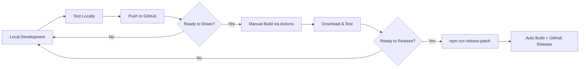

# 🚀 ArDrive Desktop MVP - Getting Started Guide

## 📁 Your Key Documents

1. **THIS FILE** - Start here! Step-by-step instructions
2. **mvp-workflow.md** - Your development workflow
3. **release-guide.md** - Detailed release process
4. **testing-distribution.md** - How to share with testers

---

## ✅ Step 1: First-Time Setup (One Time Only)

### 1.1 Verify Your GitHub Setup
```bash
# Check your remote is set up
git remote -v

# Should show:
# origin  https://github.com/[your-username]/ardrive-desktop-mvp.git
```

### 1.2 Push Your Current Code
```bash
git add .
git commit -m "feat: add GitHub Actions for builds"
git push
```

### 1.3 Verify Workflows Are Live
1. Go to: `https://github.com/[your-username]/ardrive-desktop-mvp`
2. Click the **"Actions"** tab
3. You should see: **"MVP Build & Test"** workflow

---

## 🎯 Step 2: Your First Test Build

### 2.1 Trigger a Manual Build
1. Go to the **Actions** tab on GitHub
2. Click **"MVP Build & Test"** on the left
3. Click **"Run workflow"** button (right side)
4. Select:
   - Build type: **test**
   - Platforms: **both**
5. Click green **"Run workflow"** button

### 2.2 Monitor Progress
- You'll see a yellow circle (building)
- Takes about 15-20 minutes
- Green check = success!
- Red X = check the logs

### 2.3 Download Your Apps
1. Click on the completed workflow run
2. Scroll to bottom "Artifacts" section
3. Download:
   - **Windows-build** → Contains .exe file
   - **macOS-build** → Contains .dmg file

---

## 📱 Step 3: Test Your Builds

### Windows Testing
1. Extract the downloaded zip
2. Run the `.exe` file
3. Click through SmartScreen warning (it's unsigned)

### Mac Testing  
1. Open the `.dmg` file
2. Drag ArDrive to Applications
3. First run: Right-click → "Open"

---

## 💼 Step 4: Daily Development Workflow

### Your Simple Workflow:
```bash
# 1. Make changes locally
# 2. Test locally
npm run dev

# 3. When happy, push to GitHub
git add .
git commit -m "feat: added new feature"
git push

# 4. NO BUILD HAPPENS (this is intentional!)
# 5. When you want to test, go to GitHub Actions and run manually
```

### When to Build:
- ✅ After several commits/features
- ✅ Before sharing with testers
- ✅ For release candidates
- ❌ NOT for every small change

---

## 🏷️ Step 5: Creating a Release

When you have a stable version ready:

### 5.1 Update Version & Create Release
```bash
# Updates package.json version and creates release
npm run release:patch  # 0.0.1 → 0.0.2
```

This automatically:
1. Updates version in package.json
2. Creates git tag
3. Pushes to GitHub
4. **Triggers automatic build**
5. Creates GitHub Release with downloads

### 5.2 Share Release
Your release URL will be:
```
https://github.com/[your-username]/ardrive-desktop-mvp/releases/latest
```

---

## 📊 Step 6: Monitor Your Usage

### GitHub Actions Free Tier
- **Limit**: 2,000 minutes/month
- **Per build**: ~18-20 minutes
- **Monthly builds**: ~100

Check usage:
1. Go to Settings → Billing → Actions
2. Shows minutes used this month

---

## 🎨 Your Complete Workflow



---

## 🚨 Quick Troubleshooting

### Build Failed?
1. Click on the failed build in Actions
2. Click on the failed step
3. Read error message
4. Common fixes:
   - Run `npm run typecheck` locally
   - Run `npm run lint` locally
   - Ensure all files are committed

### Can't Download Artifacts?
- Must be logged into GitHub
- Artifacts expire after 7 days

### SmartScreen/Gatekeeper Warnings?
- Normal for unsigned apps
- Windows: "More info" → "Run anyway"
- Mac: Right-click → "Open"

---

## 📝 Command Reference

### Local Development
```bash
npm run dev          # Start development mode
npm run build        # Build locally
npm run typecheck    # Check TypeScript
npm run lint         # Check code style
```

### Building Locally (Optional)
```bash
npm run dist:win     # Build Windows locally
npm run dist:mac     # Build Mac locally
```

### Releases
```bash
npm run release:patch  # 0.0.1 → 0.0.2 + release
npm run release:minor  # 0.0.1 → 0.1.0 + release  
npm run release:major  # 0.0.1 → 1.0.0 + release
```

---

## ✨ Best Practices for MVP

### DO ✅
- Test locally before pushing
- Batch changes before building
- Use manual builds wisely
- Tag releases properly
- Keep commits descriptive

### DON'T ❌
- Build for every commit
- Enable automatic builds
- Worry about code signing yet
- Create complex branches
- Waste Actions minutes

---

## 🎯 Your Next Steps

1. **Right Now**: Try your first manual build (Step 2 above)
2. **This Week**: Share test build with 2-3 testers
3. **Next Week**: Create your first release (v0.1.0)
4. **Future**: Add code signing when going to production

---

## 📚 Additional Resources

- **Workflow Details**: See `mvp-workflow.md`
- **Release Process**: See `release-guide.md`
- **Testing Guide**: See `testing-distribution.md`
- **GitHub Actions**: `.github/workflows/mvp-workflow.yml`

---

## 🆘 Need Help?

1. Check the error logs in GitHub Actions
2. Run tests locally first
3. Ensure all changes are committed
4. Check you're under the 2000 minute limit

---

**Remember**: This is an MVP. Keep it simple, test manually, and only build when you need to share or release!